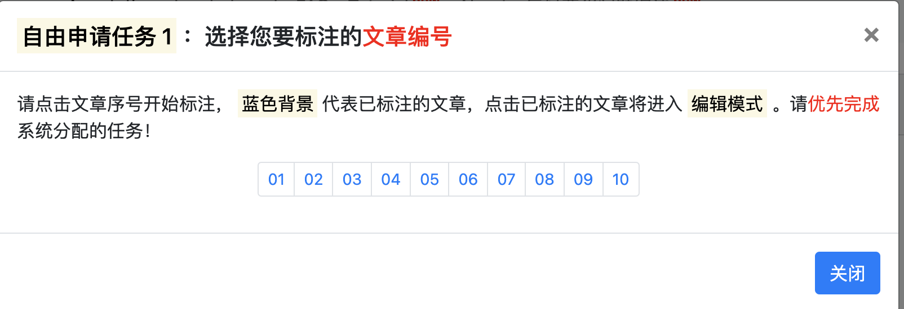

## A Literature Abstract Annotation Tool for Argumentation Mining

In this repository, we share a literature abstract annotation tool for argumentation mining. It is also the annotation web tool mentioned in the paper "A Structure-Aware Argument Encoder for Literature Discourse Analysis". You can watch a tutorial on how to use the tool at [https://www.youtube.com/watch?v=xILPAn5EZH4](https://www.youtube.com/watch?v=xILPAn5EZH4).

The tool is a complete annotation suite based on [Django](https://www.djangoproject.com/) that includes the following features. 

- User (Annotator)
  - login
  - register
  - sign-out
  - setting
- Reviewer
  - login
  - rectification
- Task distribution
  - system distribution
  - user application
- Argumentation Mining
  - argument type classification
  - argument relation recognition
- Admin
- Leaderboard
- Search Engine

Our annotation process is that users (annotators) need to register and log in to their accounts first, and then managers can assign corresponding jobs to any user, and users who meet the permissions can also apply jobs freely. Reviewers can make corrections on major disagreements. User permissions can be manually updated by the administrator in the admin site, and all annotated records can be viewed.





### Requirements

- python==3.7
- django==3.0
- nltk==3.7
- pymysql==1.0.2
- tqdm==4.64.0
- numpy
- sklearn

```shell
# create conda environment
conda create -n django3 python=3.7
source activate django3

# install packages
pip install -r requirements.txt
```

### Create Database

Please first install mysql or other database for storing user data, we take [mysql](https://www.mysql.com/) for example.  

```mysql
DROP DATABASE if exists amcl;
CREATE DATABASE if not exists amcl DEFAULT CHARACTER SET utf8mb4 COLLATE utf8mb4_general_ci;
```

### Django Setting

please set up database and e-mail in `amcl/settings.py`. Besides, you also need to set the IP address and port in `annotation/utils/mail.py`, which should be consistent with the project deployment.  

### Django Migration

```shell
python manage.py makemigrations
python manage.py migrate
python manage.py createsuperuser
```

### Django Server

```shell
python manage.py runserver 127.0.0.1:8888
```

When everything is ready, you can visit annotation homepage in http://127.0.0.1:8888/annotation, and admin homepage in http://127.0.0.1:8888/admin/. Based on this code, you have the flexibility to add tasks or functions that you want to add. 

### Task Assignment

- Insert Data

```shell
python insert_data.py
```

- Create Virtual User

```shell
python create_user.py
```

- Apply Job

You can log in the website with the created test user accounts now. 

```
# annotator
username/password: test1/test1

# reviewer
username/password: test2/test2
```

Annotator can also apply for jobs freely, and administrators can modify the `assign` function in `annotation/utils/assign` to change the distributed logic. 

Reviewer handles disagreements in multiple annotators, and there is an additional "review" column on their homepage. 

- Assign Job to User (optional)

You may want to assign jobs to users manually, you can do it as follows.

```python
from annotation.utils.job import assign

# assign 10 abstracts to user with uid 0
assign(uid=1, job_size=10, job_type=0)
```

We provide a service website for testing, which host on http://10.192.9.84:20026/annotation/, where the username and password are both `test1`. For some reasons, this website can only be accessed through Fudan University's intranet. 

### How to Cite

If you extend or use this work, please cite the paper where it was introduced. 

**Note**: We will release the paper "A Structure-Aware Argument Encoder for Literature Discourse Analysis" on arxiv soon.

### Get Data

In our paper, we introduce a new argumentation mining corpus that focuses on the field of climate change, which we will host in a new repository, and the corresponding code will be also released.
